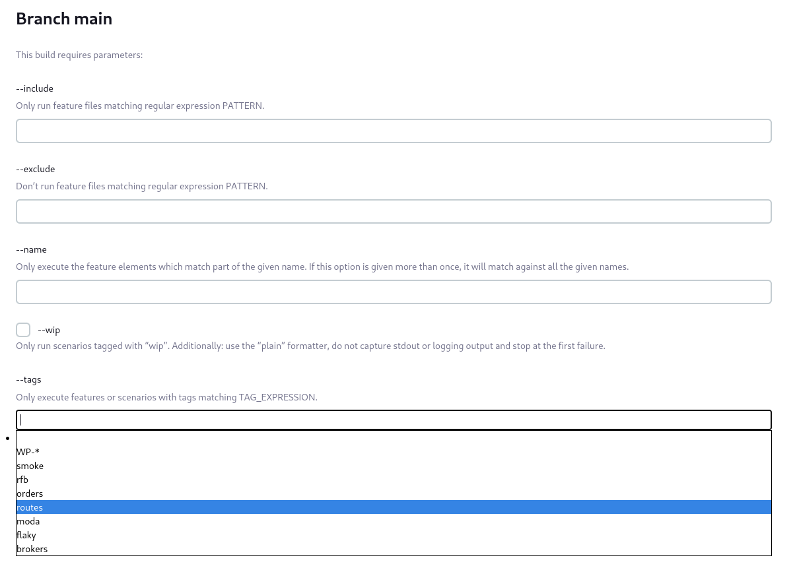
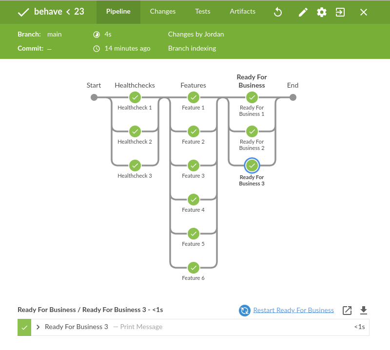

# Python Behave Configurable Pipeline

The Jenkinsfile in this project produces the following `Build with Parameters` page for ad-hoc builds.

It also provides an example of multiple stages & test parallelization.

## Active Choice Plugin

### Active Choice Reactive:

### Active Choice:

### Editable Choice:

